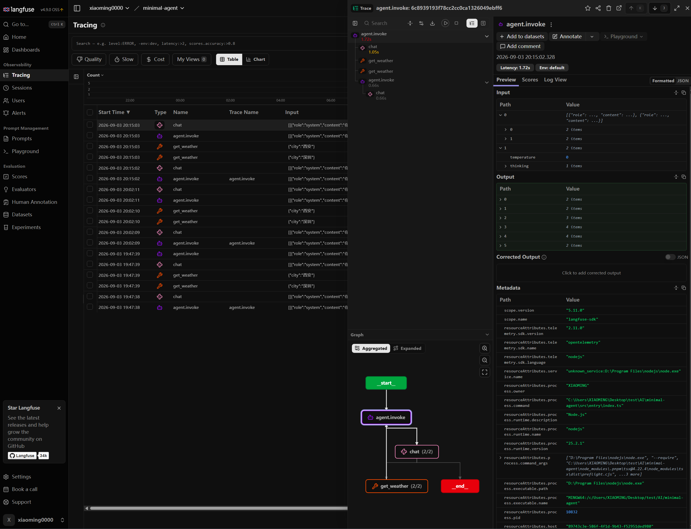

# minimal-agent

[English](./README.en.md) | 简体中文

一个最小可用的 LLM Agent：自实现 ChatClient 调用 Chat Completions，用 Zod 定义工具，通过 ReAct 式循环完成 tool calling。

## 特性

- **Agent 循环** — 调模型 → 执行工具 → 再调模型，直到没有 `tool_calls`
- **工具定义** — `tool()` 将 Zod schema 转成 function calling
- **并发执行** — 同一轮多个工具调用可并行，默认最多 5 个
- **ChatClient** — 非流式与 SSE 流式 `/v1/chat/completions`
- **Langfuse 追踪** — 可选接入，观测 Agent / Generation / Tool 调用链
- **TypeScript + esbuild** — 严格模式，打包输出至 `dist/`

## 环境要求

| 工具    | 版本       |
| ------- | ---------- |
| Node.js | >= 22.13.0 |
| pnpm    | >= 11.23.0 |

## 快速开始

```bash
# 克隆项目
git clone https://github.com/XiaoMing0000/minimal-agent.git
cd minimal-agent

# 安装依赖
pnpm install

# 配置环境变量
cp .env.example .env
```

在 `.env` 中填写 DeepSeek 的地址、密钥和模型，然后启动：

```bash
pnpm dev
```

默认入口 `src/entry/index.ts` 会注册一个 `get_weather` 示例工具，并让 Agent 查询深圳和西安的天气。

## 常用命令

| 命令               | 说明                             |
| ------------------ | -------------------------------- |
| `pnpm dev`         | 开发模式，监听文件变更并自动重启 |
| `pnpm dev:unwatch` | 直接用 tsx 运行入口，不监听      |
| `pnpm build`       | 使用 esbuild 打包至 `dist/`      |
| `pnpm start`       | 运行打包后的产物                 |
| `pnpm lint:check`  | oxlint + TypeScript 类型检查     |
| `pnpm fmt`         | 使用 oxfmt 格式化代码            |

## 项目结构

```
minimal-agent/
├── config/
│   └── esbuild.config.mts   # esbuild 构建配置
├── src/
│   ├── config/config.ts     # 环境变量
│   └── entry/
│       ├── index.ts         # 示例入口（天气 Agent）
│       ├── core/
│       │   ├── agents.ts    # Agent 循环
│       │   ├── chat-client.ts
│       │   ├── tools.ts     # 工具定义
│       │   └── sse.ts       # SSE 解析
│       └── utils/utils.ts   # 并发任务队列
├── example/                   # ChatClient 示例
├── dist/                      # 构建输出
├── .env.example               # 环境变量模板
└── package.json
```

## 环境变量

复制 `.env.example` 为 `.env`，按需填写：

```bash
cp .env.example .env
```

| 变量                   | 说明                             |
| ---------------------- | -------------------------------- |
| `DEEPSEEK_API_KEY`     | API Key                          |
| `DEEPSEEK_BASE_URL`    | Chat Completions 接口的 Base URL |
| `DEEPSEEK_MODEL`       | 默认模型                         |
| `DEEPSEEK_FLASH_MODEL` | 示例入口使用的模型               |
| `LANGFUSE_PUBLIC_KEY`  | Langfuse Public Key（留空则不上报） |
| `LANGFUSE_SECRET_KEY`  | Langfuse Secret Key              |
| `LANGFUSE_BASE_URL`    | Langfuse 服务地址，默认为云端    |

`ChatClient` 请求 `{baseUrl}/v1/chat/completions`，因此 Base URL 不要带该路径后缀。

配置 Langfuse 后，一次 Agent 调用会在控制台看到完整 trace，例如：



## 核心用法

```ts
import { z } from 'zod';
import { Agent } from './core/agents';
import { ChatClient } from './core/chat-client';
import { tool } from './core/tools';

const weatherTool = tool(({ city }) => ({ weather: `${city} 的天气是晴天。` }), {
  name: 'get_weather',
  description: '查询指定城市当前天气',
  schema: z.object({
    city: z.string().describe('需要查询天气的城市'),
  }),
});

const client = new ChatClient(baseUrl, apiKey, model);
const agent = new Agent({ client, tools: [weatherTool] });

const messages = await agent.invoke([
  { role: 'system', content: '你是一个天气助手。' },
  { role: 'user', content: '查询深圳当前天气' },
]);
```

`invoke` 默认循环深度 15、工具并发 5，可通过第三个参数覆盖。

仅调用模型（不走 Agent 循环）时，可直接使用 `ChatClient`：

```ts
const client = new ChatClient(baseUrl, apiKey, model);
const res = await client.chat([{ role: 'user', content: 'Hello' }]);
```

流式示例见 `example/chat-client.ts`。

## 代码质量

| 钩子         | 行为                                        |
| ------------ | ------------------------------------------- |
| `pre-commit` | lint-staged：oxfmt + oxlint --fix           |
| `commit-msg` | 检查 changelog                              |
| `pre-push`   | `pnpm run fmt:check && pnpm run lint:check` |

## 技术栈

| 类别        | 依赖                                  |
| ----------- | ------------------------------------- |
| 运行时      | Node.js                               |
| 语言        | TypeScript                            |
| LLM         | 自实现 ChatClient（Chat Completions） |
| 工具 schema | Zod                                   |
| 打包        | esbuild                               |
| 代码检查    | oxlint, tsc                           |
| 格式化      | oxfmt                                 |

## 许可证

[MIT](./LICENSE)

## 作者

[xiaoming0000](https://github.com/XiaoMing0000)
